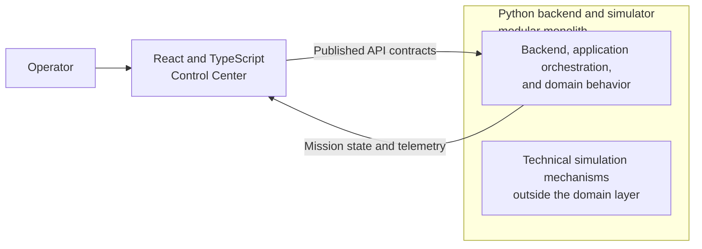
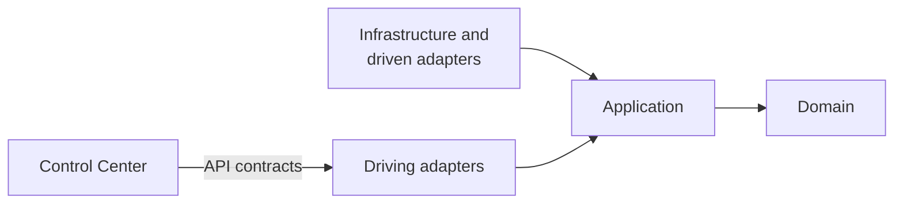

# ReBot Architecture Overview

## 1. Purpose and Scope

This document describes the initial architecture for the ReBot MVP. It records system boundaries, dependency rules, responsibility allocation, an initial deployment direction, and the intended testing levels. It does not authorize implementation or define physical source paths, concrete port interfaces, technology selections, or additional product behavior.

The confirmed system shape is a modular monolith for the Python core, with explicit ports and adapters and a separately built React and TypeScript Control Center. Candidate future components are identified as candidates rather than approved implementations.

## 2. Architectural Drivers

The product and domain documents establish these architectural drivers:

- Demonstrate one understandable end-to-end Cleaning Mission in a deterministic, two-dimensional grid-based simulation.
- Keep Robot movement, Position, Battery Level, Robot Operational State, Mission State, Mission Progress, waste lifecycle changes, Incidents, and Mission Result observable to the Operator.
- Protect confirmed Mission, Robot, Waste Item, Route, battery, collection, deposit, Required Incident, and completion rules from delivery and framework concerns.
- Support Operator control through the Control Center without coupling that client to Python domain or application code.
- Preserve repeatability and testability while allowing technical mechanisms to be selected only when justified.
- Keep the MVP limited to one Robot, static Obstacles, and the approved Processable Waste policy rather than designing prematurely for long-term possibilities.
- Demonstrate sustainable engineering through explicit boundaries, inward dependencies, TDD, BDD, and focused testing.

## 3. High-Level System Context

The Operator uses the Control Center to control and observe Cleaning Missions. The Control Center is outside the Python core and communicates through published API contracts. Within the conceptual Python system, application orchestration invokes domain behavior and coordinates the deterministic Simulated Environment through ports and adapters.

The diagram shows architectural relationships, not processes, protocols, executable components, or final interfaces. The simulation mechanisms shown are conceptual technical support for the Simulated Environment; they are not the domain itself.

## 4. Logical Boundaries

The confirmed logical boundaries are:

- **Domain:** confirmed business behavior, state transitions, and invariants expressed in the ReBot ubiquitous language.
- **Application:** use-case coordination, invocation of domain behavior, definition of ports required by use cases, and operation boundaries when needed.
- **Driving adapters:** mechanisms that initiate application behavior. Candidate roles include a backend HTTP API, simulation controls, and the Control Center acting through the API.
- **Driven adapters and infrastructure:** technical mechanisms used through application ports. Candidate roles include persistence, telemetry delivery, deterministic time or simulation mechanisms, and other justified external technical services.
- **Control Center:** a separately built external driving adapter that presents controls and observations to the Operator through published API contracts.
- **Composition and bootstrap:** the single boundary at which concrete adapters are wired to application ports.

These are responsibility boundaries. They do not establish physical packages, concrete classes, port signatures, aggregate boundaries, repositories, domain events, entities, value objects, or domain services.

## 5. Dependency Rules

Dependencies point inward:

- Infrastructure and adapters may depend on application and domain.
- Application may depend on domain.
- Domain depends on neither application nor infrastructure.
- The Control Center communicates through published API contracts and never imports Python domain or application code.
- Frameworks and delivery mechanisms remain at the edges.
- Concrete adapters implement or satisfy ports defined inward of them; application behavior does not depend on concrete infrastructure implementations.

The domain must not depend on FastAPI, Pydantic, SQLAlchemy or another ORM, databases, HTTP, React, transport DTOs, filesystem APIs, external services, or simulation rendering libraries. Naming these exclusions does not select any technology for use elsewhere.

## 6. Domain Responsibilities

The domain owns the confirmed behavior and invariants documented in `docs/domain/domain-rules.md`, including:

- Cleaning Mission and Robot state transitions.
- Waste Item lifecycle behavior and the MVP Processable Waste policy.
- Minimum Route semantics and movement constraints.
- Battery Level bounds, consumption behavior, action sufficiency, and the Required Incident caused by insufficient Battery Level.
- Collection and deposit rules, including one carried Waste Item and Compatible Collection Point requirements.
- Required Incident creation and reporting requirements established by confirmed rules.
- Cleaning Mission completion conditions and the associated Mission and Robot transitions.

The domain expresses valid state changes and rejects invalid ones. This responsibility statement does not decide how the model is divided into aggregates, entities, value objects, domain services, domain policies, repositories, or domain events. Such structures require evidence from future implementation work and are not approved here.

## 7. Application Responsibilities

The application layer:

- Coordinates use cases and participating domain behavior.
- Invokes domain operations rather than reimplementing domain invariants.
- Defines only the ports required by accepted use cases.
- Controls transactional or operation boundaries when those become necessary.
- Coordinates delivery of observable information without defining transport details in the domain.
- Depends on domain abstractions and not on concrete infrastructure implementations.

Candidate use cases derived from the MVP include starting, pausing, resuming, and cancelling a Cleaning Mission; advancing a deterministic simulation step; and obtaining observable mission information. These are candidates only, not finalized interfaces, commands, classes, or port definitions.

## 8. Adapter and Infrastructure Responsibilities

Driving adapters translate external intent into application interactions and translate application outcomes for external consumers. Candidate driving adapters are:

- A backend HTTP API.
- Simulation controls.
- The Control Center communicating through the published API contracts.

Driven adapters provide technical capabilities requested through application ports. Candidate driven adapters are:

- Persistence, if and when persistence requirements are approved.
- Telemetry delivery.
- Time or deterministic simulation mechanisms.
- Other external technical services justified by accepted use cases.

Adapters own framework integration, transport mapping, serialization, and other edge concerns. Infrastructure does not define domain rules. These roles do not approve implementations, concrete port interfaces, protocols, persistence systems, or messaging systems.

## 9. Simulation Boundary

The simulation is not the domain itself. The domain defines valid Route semantics, state transitions, Battery Level behavior, Waste Item handling, Required Incidents, and Cleaning Mission completion rules. Application orchestration coordinates a simulation step or use case and invokes those domain behaviors.

Technical timing, execution loops, rendering, transport, and framework integration remain outside the domain. The exact simulation loop and clock abstraction are intentionally deferred. Determinism is a required product characteristic, but the technical mechanism that provides it has not been selected.

## 10. Control Center Boundary

The React and TypeScript Control Center is an external driving adapter for the Operator. It starts, pauses, resumes, and cancels Cleaning Missions through published API contracts and presents the approved observable information.

The Control Center does not import Python domain or application code, enforce authoritative domain invariants, or share internal Python models. Contract representations at this boundary are delivery concerns and must not become domain transport DTO dependencies. The API framework, frontend state library, telemetry transport, and detailed visual design remain deferred.

## 11. Composition and Bootstrap Boundary

ReBot will have one composition and bootstrap boundary where concrete adapters are created and wired to application ports. This boundary owns startup and dependency assembly so that the domain and application layers do not locate or construct infrastructure dependencies.

This decision does not define the boundary's physical location, configuration mechanism, lifecycle framework, or executable entry point.

## 12. Initial Deployment View

The MVP may be delivered as:

- One Python backend and simulator process containing the modular monolith.
- One separately built React and TypeScript web client serving the Control Center.

This is an initial deployment direction, not a division into distributed domain services. It does not select hosting, containers, cloud infrastructure, process supervision, or production topology.

## 13. Testing Strategy by Architectural Boundary

TDD follows `Red -> Green -> Refactor`. BDD scenarios serve as executable or traceable acceptance specifications for externally observable behavior.

- **Domain unit tests:** verify invariants, state transitions, and confirmed behavior without frameworks or infrastructure.
- **Application tests:** verify use-case coordination with test doubles for ports and ensure domain behavior is invoked correctly.
- **Adapter integration tests:** verify mappings and integration at individual technical boundaries.
- **Architecture tests:** verify inward dependency direction and prohibited domain dependencies.
- **API contract tests:** verify the published contract between the Control Center and backend boundary.
- **Frontend component and interaction tests:** verify Operator controls and presentation behavior at the Control Center boundary.
- **End-to-end tests:** cover a small number of critical Operator journeys across deployed boundaries.
- **BDD scenarios:** connect acceptance behavior to product and domain terminology without replacing focused tests.

Exact test libraries, BDD tools, coverage thresholds, and CI tooling are intentionally not selected.

## 14. Decisions Intentionally Deferred

The architecture does not yet decide:

- Physical source paths, package layout, concrete interfaces, classes, or port signatures.
- Aggregate boundaries, repositories, domain events, entities, value objects, or domain services beyond what future evidence justifies.
- The simulation loop, clock abstraction, Route-planning algorithm, rendering mechanism, or detailed simulation controls.
- Persistence requirements or technology, database technology, ORM, messaging, and telemetry transport or delivery details.
- Backend API framework, serialization approach, real-time transport, or exact published API shape.
- Frontend state library, component library, build tooling, or detailed Control Center design.
- Python and Node versions, package managers, containers, cloud infrastructure, and production deployment topology.
- Exact testing libraries, BDD libraries, coverage thresholds, and CI tooling.
- All unresolved product and domain decisions already listed in `docs/product/mvp.md`, `docs/domain/ubiquitous-language.md`, and `docs/domain/domain-rules.md`.

Deferral preserves the approved MVP scope and prevents technical choices from being mistaken for confirmed domain behavior.

## 15. Traceability

- `docs/product/vision.md` defines the product purpose, principles, long-term boundary, and current non-goals.
- `docs/product/mvp.md` defines the MVP journey, functional scope, observable behavior, success criteria, and deferred product decisions.
- `docs/domain/ubiquitous-language.md` defines the canonical ReBot vocabulary used by this architecture.
- `docs/domain/domain-rules.md` is the authoritative source for confirmed domain invariants, behavior, and unresolved domain decisions.
- `docs/architecture/adr-0001-modular-monolith-and-hexagonal-architecture.md` records the decision to use a modular monolith with Hexagonal and Clean Architecture.

This overview allocates responsibility for those existing commitments; it does not duplicate or alter them.
